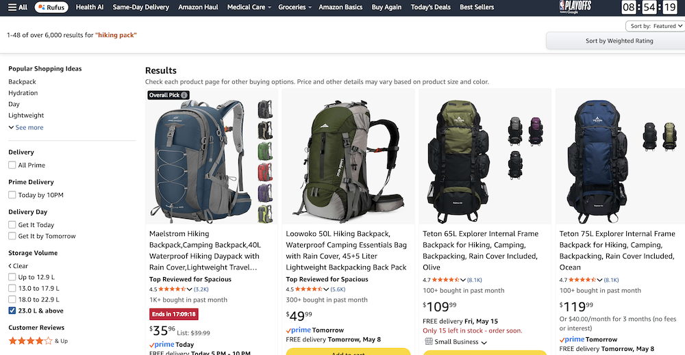
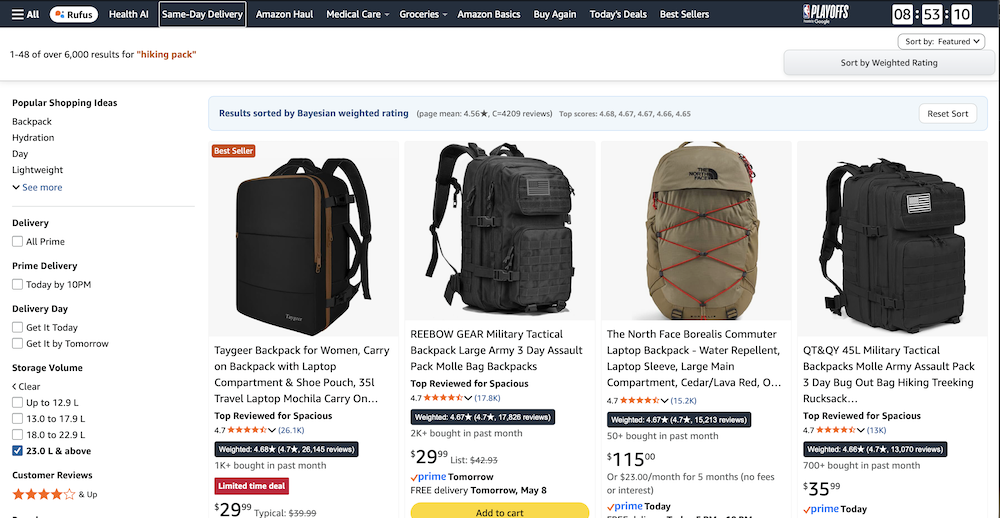

# Amazon Sort by Weighted Rating

A tiny browser script that helps Amazon search results make more sense.

Instead of sorting products by **raw star rating alone**, this script tries to answer:

> “Is this product actually well-reviewed, or does it just have a tiny number of reviews?”

---

## What problem does this solve?

On Amazon, a product with:

* ⭐ **5.0 stars from 3 reviews**

can appear better than:

* ⭐ **4.7 stars from 12,000 reviews**

That’s usually misleading.

This script uses a smarter math method called a **Bayesian weighted rating** to balance:

* how good the reviews are
* AND how many reviews exist

So products with a *large number of consistently good reviews* rise toward the top.

---

# Explain Like I'm 5

Imagine two kids say they make the best cookies.

### Kid A

* Got **5 stars**
* But only **2 people** tasted the cookies

### Kid B

* Got **4.7 stars**
* And **5,000 people** tasted the cookies

Who do you trust more?

Probably Kid B.

This script helps Amazon sort products more like that.

---

# What the script does

When you open Amazon search results:

1. The script adds a new button:  
   **“Sort by Weighted Rating”** (appears a moment after the page loads)

2. When clicked, it:

   * Reads every product on the page
   * Finds:
     * star rating
     * number of reviews
   * Calculates a smarter score
   * Re-sorts the products

3. It also adds a small badge showing:

   * weighted score
   * original star rating
   * review count

4. A **Reset Sort** button appears at the top of the results – click it to reload the page and restore Amazon’s original order.

---

## Before & After – See it in action

Below is the same Amazon search page for “backpack” – first in Amazon’s default order, then after clicking **Sort by Weighted Rating**.

| Amazon’s default order | Sorted by weighted rating |
|------------------------|---------------------------|
|  |  |

**What changed?**
- Products with many good reviews (e.g., 17k reviews, 4.7★) move to the top.
- Each product now shows a **Weighted: X.XX★** badge.
- The page shows a blue info bar with the page average and the `C` value used for the Bayesian calculation.
- A **Reset Sort** button lets you revert to Amazon’s original order.

> *Note: Your actual results may vary slightly because Amazon changes its HTML layout from time to time. The script adapts automatically.*
---

# Features

* Adds a one-click sorting button to Amazon search pages (re‑added automatically if Amazon loads more results dynamically)
* Uses Bayesian weighted ratings with auto‑calibrated parameters
* Works with newer and older Amazon layouts
* Handles:
  * normal review counts
  * abbreviated counts like `2.1K`
* Adds visible weighted score badges
* Includes fallback parsing logic when Amazon changes page structure
* Provides a “Reset Sort” button to reload the page

---

# How the scoring works

The script uses this formula:

```text
(C * global_mean_rating + product_rating * review_count)
---------------------------------------------------------
               (C + review_count)
```

Where:

global_mean_rating = average star rating of all products on the current page
C = average review count of all products on the current page (auto‑calibrated)
In simple terms:

Products with very few reviews get “skeptically adjusted”
Products with lots of reviews earn more trust
Ratings become more realistic overall
Installation

You need a userscript manager browser extension like:

Tampermonkey
Violentmonkey
Then:

1. Create a new userscript
2. Paste in the script
3. Save
4. Open Amazon search results
5. Click:
6. Sort by Weighted Rating
7. Why this is useful

#### This script is especially helpful for:
* avoiding fake‑review junk products
* finding reliable products faster
* comparing popular products more fairly
* reducing “review manipulation” effects

It won’t make Amazon perfect, but it usually produces much better rankings than raw stars alone.

## Limitations

Amazon changes their website often.
The script includes fallback logic to survive layout changes, but occasionally Amazon may break parts of it until updated.

Also:

It only sorts products currently loaded on the page
It cannot access hidden or unloaded results (e.g., paginated results)
Sponsored products may still appear (the script sorts them along with organic results, but cannot remove them)
The sorting button appears ~1.5 seconds after the page loads – this is intentional to ensure Amazon has rendered the sort dropdown
License

MIT License

Author

Created by zerofux
GitHub: shipit-0fux/userscripts